# Segmentation of Cell Cycles Images

SCC0251 - Image Processing

**G4** - Name: Breno Lívio Silva de Almeida, NUSP: 10276675

---

You can view the Jupyter Notebook for demonstrations here: [Jupyter Notebook](https://nbviewer.jupyter.org/github/brenoslivio/SegmentationCellCycles/blob/main/SegCellCycles.ipynb)

---

<!-- TABLE OF CONTENTS -->

<summary><h2 style="display: inline-block">Table of Contents</h2></summary>
<ol>
    <li>
    <a href="#installation">Installation</a>
    <ul>
      <li><a href="#running-the-program">Running the Program</a></li>
      <li><a href="#running-jupyter-notebook">Running Jupyter Notebook</a></li>
    </ul>
    </li>
      <li><a href="#file-contents">File Contents</a></li>
  <li>
    <a href="#about-the-project">About the Project</a>
    <ul>
      <li><a href="#introduction">Introduction</a></li>
      <li><a href="#objective">Objective</a></li>
      <li><a href="#methodology">Methodology</a>
          <ul>
      <li><a href="#image-pre-processing">Image Pre-processing</a></li>
      <li><a href="#segmentation-methods">Segmentation Methods</a></li>
      <li><a href="#segmentation-processing">Segmentation Processing</a></li>
      <li><a href="#connected-component-labeling">Connected-component Labeling</a></li>
        <li><a href="#evaluating-segmentation-methods">Evaluating Segmentation Methods</a></li>
        </ul>
      </li>
      <li><a href="#examples">Examples</a></li>
      <li><a href="#results-and-discussion">Results and Discussion</a></li>
      <li><a href="#references">References</a></li>
    </ul>
  </li>
  <li><a href="#license">License</a></li>
</ol>

---

## Installation

With Python 3, install virtualenvwrapper to manage virtual environments

```
pip install --user virtualenvwrapper
```

start the virtualenvwrapper
```
$ source /usr/local/bin/virtualenvwrapper.sh
```

make sure to include this at the shell session startup - usually .bashrc 
```
echo 'source /usr/local/bin/virtualenvwrapper.sh' >> ~/.bashrc
```

in order to create a new environment called venv use:
```
mkvirtualenv venv
```

inside the virtual environment, install all needed python packages
```
(venv) $ pip install numpy
(venv) $ pip install pandas
(venv) $ pip install imageio
(venv) $ pip install matplotlib
(venv) $ pip install seaborn
(venv) $ pip install opencv-python
(venv) $ pip install scikit-learn
(venv) $ pip install scipy
(venv) $ pip install jupyter
```

if you want to enter the virtual environment later, just type
```
workon venv
```

### Running the Program

With the modules installed, run the main source file.

```
(venv) $ python main.py
```

### Running Jupyter Notebook

It opens on your browser in order to create new notebooks or run existing ones. In order to run the project's notebook, you need to run the following command.

```
(venv) $ jupyter notebook
```

## File Contents

This repository consists of the following folders:

- [Data](./Data) - Folder for saving original and segmented images;
- [Images](./Images) - Folder for saving images for the README.

We have the following Python source codes for the project:

- [CalculateError.py](./CalculateError.py) - Calculate Jaccard Index for the images;
- [ConnectedComponent.py](./ConnectedComponent.py) - Contains functions related to Connected-component labeling;
- [ImagePreprocessing.py](./ImagePreprocessing.py) - Contains functions related to image pre-processing as luminance, scaling, histogram equalization and gaussian filter;
- [ImageSegmentation.py](./ImageSegmentation.py) - Contains functions for applying the segmentations methods for all images;
- [RenameFiles.py](./RenameFiles.py) - Auxiliary function to helping rename files from Kaggle;
- [main.py](./main.py) - Contains the main function to run the program.

Output for the project:

- [results.txt](./results.txt) - Output of operation time and descriptive statistics of segmentation methods with Jaccard Index scores.

Jupyter Notebook:

- [SegCellCycles.ipynb](./SegCellCycles.ipynb) - Jupyter Notebook demonstrating the project.


---
## About the Project

### Introduction

It's known the association of differences in the rates of cellular division and differences in the amount of time spent in each stage of cellular division between healthy and cancer cells [[1]](#ref1). Therefore, it's essential to create methods to analyze images of a process as cell division.

We will explore the following dataset:
https://www.kaggle.com/paultimothymooney/cell-cycle-experiments

The input will be the nematode cells images in the dataset from Kaggle. The [images](https://github.com/brenoslivio/SegmentationCellCycles/tree/main/Data/Original) are divided in interphase and mitosis cycles. There are 90 images in total, being 57 of interphase and 33 of mitosis cycles. Every image has a size of 256 x 256 with 3 channels (R, G, B).

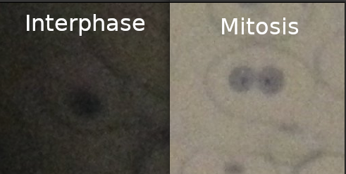

### Objective

With the images, it will be done the process of image segmentation for the Nuclei. Before proper segmentation, the image will be pre-processed using enhancement and filtering techniques. With this, two segmentation methods will be used and compared, Region-Based and Clustering. The segmentations methods will be evaluated using metrics as the Jaccard Index [[2]](#ref2).

Note that all images will be segmented so we will have an average score of how accurate a segmentation method is to classify the nuclei in the images.

### Methodology

The project consists of the following pipeline:

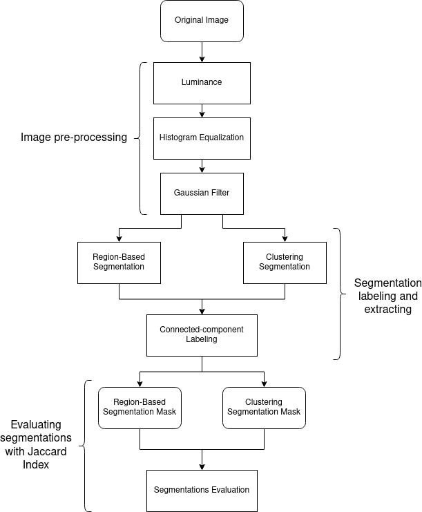

#### Image pre-processing

Before the process of segmentation, the input image needs essential adjustments. The order used for the project is:

- Convert to grayscale for proper processing;
- Histogram Equalization for contrast adjustment;
- Gaussian filtering smoothing image for segmentation;

#### Segmentation Methods

It will be used the following segmentation methods.

##### Region-Based Segmentation

Region-Based segmentation can separate the objects into different regions based on a threshold value. With the image converted to grayscale, for example, we can separate the darkest objects from the most enlightened ones. The nuclei are within the darkest objects in these images.

##### Segmentation by Clustering

Segmentation based on clustering can divide the pixels of the image into homogeneous clusters. For this method it will be used the k-means algorithm.

#### Segmentation Processing

With the segmentation methods applied, we can extract the Region Of Interest (ROI) the nuclei belong. This ROI would be darkest one considering the images' characteristics.

#### Connected-component Labeling

After processing the segmentation masks by extracting the ROI we have to label the connected components. Connected-component labeling is used in computer vision to detect connected regions in binary digital images [[3]](#ref3). We can extract the blobs for the Nuclei using this method.

For properly extracting the nuclei we can calculate the euclidean distance between the image center and blob's center of mass. The blob with the least distance would be the nuclei.

#### Evaluating Segmentation Methods

To evaluate the segmentations methods it will be created segmentations masks by hand using [labelme](https://github.com/wkentaro/labelme), a tool for Image Polygonal Annotation with Python. The masks are found [here](https://github.com/brenoslivio/SegmentationCellCycles/tree/main/Data/TrueMask).

The masks are created ONLY for the nuclei closer to the center. There are images with nuclei near the image border, but it would turn the project too demanding to deal with all the nuclei in the image.

The segmentations created by hand will be compared to the region-based and clustering methods, calculating the Intersection over Union (IoU) score, the Jaccard Index. 

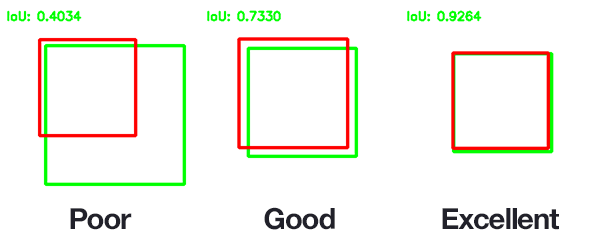

Considering the classification idea of True Positive (TP), True Negative (TN), False Positive (FP) and False Negative (FN), we have the following equation:

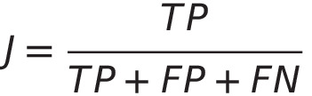

### Examples

For the partial project, it was done the Region-Based Segmentation for the [images](https://github.com/brenoslivio/SegmentationCellCycles/tree/main/Data/Original), generating [segmentation masks](https://github.com/brenoslivio/SegmentationCellCycles/tree/main/Data/Threshold).

We have the following original image (named `I4`):

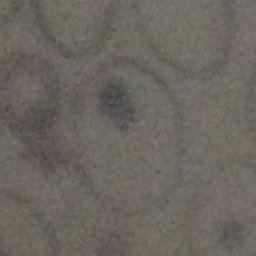

After pre-processing, using Region-Based Segmentation and applying Connect-component labeling for extracting the nuclei we have:

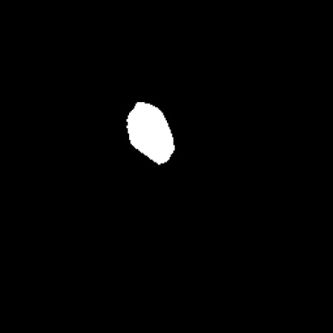

The true segmentation mask would be:

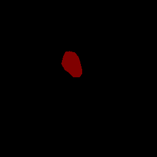

The IoU score for this case is 0.7130.

### Results and Discussion

After generating the segmentation masks and making the evaluation, descriptive statistics are informed. Considering the project reproducibility, it's expected the output to be similar to [this](https://github.com/brenoslivio/SegmentationCellCycles/blob/main/results.txt).

Considering the k-means algorithm complexity for generating clusters for the image, it was expected to be the most time demanding method.

We can see both segmentation IoU mean scores are practically identical. There are some differences related to the median and other percentiles.

A way to analyze if there's some statistical difference to the methods is to use techniques as hypothesis tests. Taking a Two-sample T-test with the IoU scores we have a p-value of 0.49. With this, we fail to reject the null hypothesis and it would be really hard to choose a segmentation method as the best.

But this doesn't tell us the whole story. Working with a boxplot graph we can see more details.

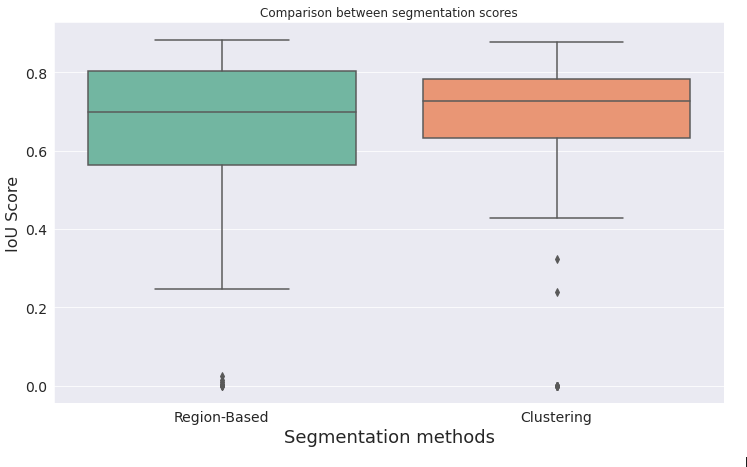

With boxplots we can better see a difference between the two segmentation methods. The average score is identical, but the score distribution has its differences.

Comparing the 1st Quartile for both, we can see a higher value for clustering, showing how this method had less inaccurate cases. In general, the clustering method is more consistent.

We can also see some outliers, probably cases with a high misclassification. We can count how many outliers we have for each method. The number of outliers for both is similar as calculated in the Jupyter Notebook.

Another way to understand even more the differences is to separate by cycle type.

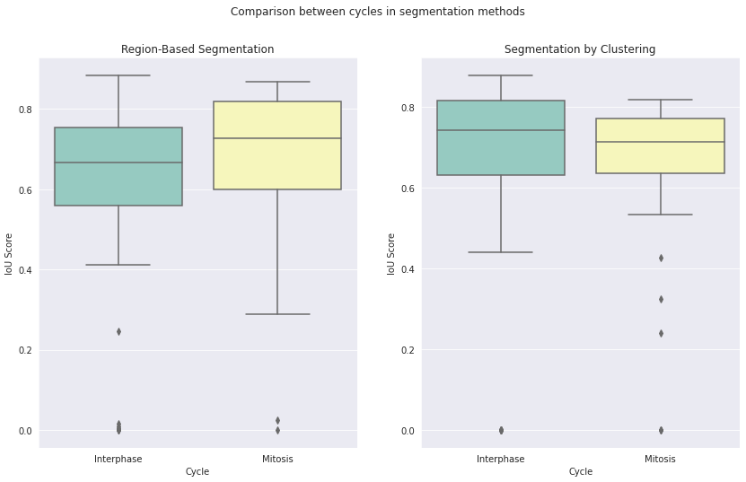

We can see a difference in how each segmentation method handled the cycles. Note that it was expected segmentation by clustering would perform slightly worst than region-based, considering how the clustering method was not getting nuclei borders properly. So, the segmentation could get only a nucleus in a mitosis cycle if the nuclei are not too close.

Being the original image `M13`:

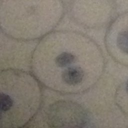

We have following true mask.

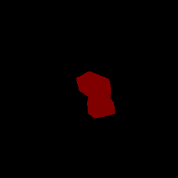

The Region-Based generated the following (with 0.71 IoU Score):

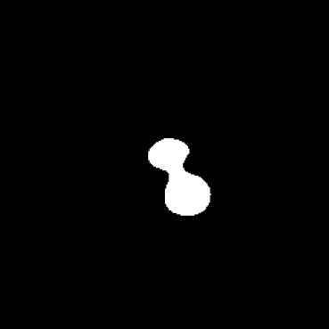

And the clustering (with 0.24 IoU Score):

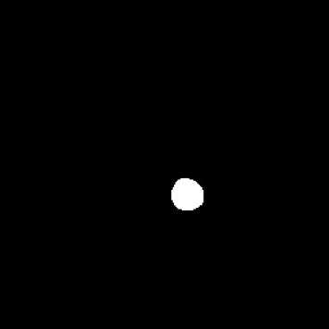

It did actually get only one nucleus. This problem could be solved using mathematical morphology with dilation that could group one nucleus to another.

And it's important to see the true mask was somewhat exaggerated, and one of the obvious justifications is the image's lighting. So, this must be taken in consideration as "human bias".

However, we can see that in some cases a method could be more suited to a task. k-means method is really useful for dealing with nuclei around darker regions.

Being the original image `I3` in interphase cycle:

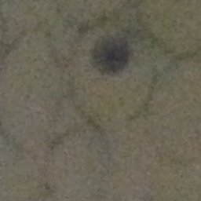

We have this Threshold result:

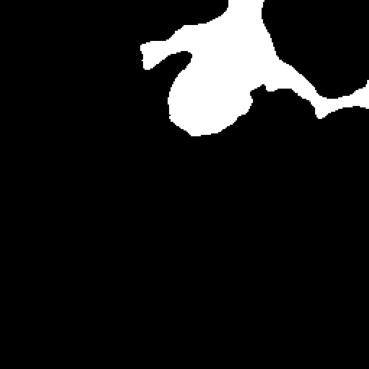

Clustering result:

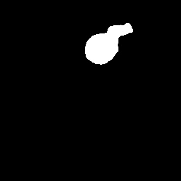

We could adjust the threshold value and the result would be possibly the same, but this would require an individual image approach. Clustering could be more generalist and better for dealing with more images.

Another important observation is that hyperparameter tuning for the segmentation methods could be used to have a better performance, but it would require an extensive amount of time for the case of this project.

Techniques as dilation from mathematical morphology could be used mainly with clustering segmentation, considering how this method disconsidered some nuclei borders.

Note that the Jaccard Index doesn't use True Negative calculation in the formula. Other metrics could be explored, and we could see a better difference between these two segmentation methods. 

### References

<a name="ref1"></a> [1] Sherr, C. J. (1996). Cancer cell cycles. Science, 274(5293), 1672-1677.

<a name="ref2"></a> [2] Wang, Z., Wang, E. & Zhu, Y. Image segmentation evaluation: a survey of methods. Artif Intell Rev 53, 5637–5674 (2020).

<a name="ref3"></a> [3] He, L., Ren, X., Gao, Q., Zhao, X., Yao, B., & Chao, Y. (2017). The connected-component labeling problem: A review of state-of-the-art algorithms. Pattern Recognition, 70, 25-43.

Jaccard Index image from [pyimagesearch](https://www.pyimagesearch.com/2016/11/07/intersection-over-union-iou-for-object-detection/).

---

<!-- LICENSE -->
## License

Distributed under the MIT License. See `LICENSE` for more information.